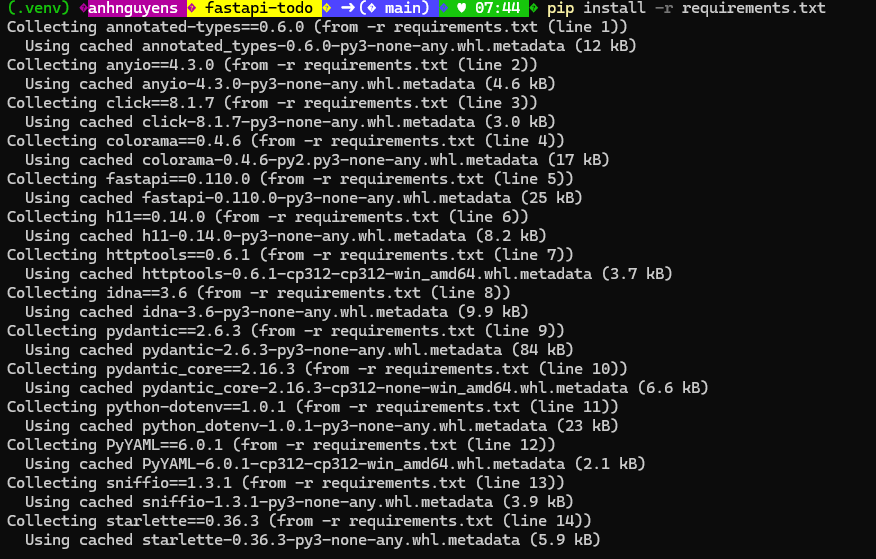

# TODO APIs with FastAPI
A practical Todo Restful API with Python FastAPI

## Set up and run the Application
### Prerequisite
- [Python](https://www.python.org/downloads/) is installed on your machine
- A [Postgresql](https://www.postgresql.org/) database
### Clone the source code
    > mkdir myfastapi
    > cd myfastapi
    > git clone https://github.com/sieunhantanbao/fastapi-todo.git
    > cd fastapi-todo
### Create [virtual environment](https://flask.palletsprojects.com/en/3.0.x/installation/#virtual-environments)
    > py -3 -m venv .venv
    > .venv\Scripts\activate
### Install dependency packages
    > pip install -r requirements.txt
    > cd app

### Rename the sample.env to .env and update the configuration
    DB_ENGINE=postgresql
    DB_HOST=
    DB_USERNAME=
    DB_PASSWORD=
    DB_PORT=
    DB_NAME=sample.db
    JWT_SECRET=
    JWT_ALGORITHM=HS256
### Create Postgresql database name to match with the DB_NAME above
### Run the database migration
    > alembic upgrade head

### Run the app
    > uvicorn main:app --reload

### View the app (swagger) on browser

